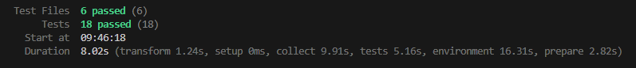

# Smart Librarian Chatbot

An AI-powered book recommendation system using OpenAI, ChromaDB (RAG), and the CMU Book Summary Dataset. Features both a CLI and a modern React web frontend.

---

## Features
- Book recommendations based on user queries/themes
- Detailed book summaries
- Multilingual support (English/Romanian)
- User profile filtering (child, teen, adult, technical)
- Voice input (speech-to-text)
- Voice output (text-to-speech)
- Book cover image generation (DALL·E)
- Content filtering and prompt sanitization
- CLI and React web frontend
- Robust test coverage

---

## Dataset
Uses the [CMU Book Summary Dataset](https://www.kaggle.com/datasets/ymaricar/cmu-book-summary-dataset).

---

## Project Structure
- `cli/`         – Command-line chatbot interface (Python)
- `frontend/`    – React web app
- `api_server.py`– FastAPI backend (serves both CLI and frontend)
- `search/`      – Semantic search and summary tools
- `utils/`       – Filtering, image generation, voice, etc.
- `data/`        – Summaries, bad words, and other resources

---

## Setup & Usage

### Backend (CLI & API)
1. Install Python dependencies:
   ```sh
   pip install -r requirements.txt
   ```
2. Set your OpenAI API key:
   ```sh
   set OPENAI_API_KEY=your-key-here
   ```
3. (Optional) Prepare embeddings:
   ```sh
   python embeddings/embedding_storing.py
   ```
4. Run the CLI chatbot:
   ```sh
   python cli/chatbot.py
   ```
5. Start the backend API server (for frontend):
   ```sh
   uvicorn api_server:app --reload
   ```
6. Run backend tests:
   ```sh
   pytest
   ```

## Authentication (JWT)

This project uses JSON Web Tokens (JWT) for user authentication and authorization. After logging in or registering, you will receive a JWT token. This token must be included in the `Authorization` header as a Bearer token for all protected API requests.

**Frontend:**
- The React app automatically stores and sends the JWT token for authenticated requests.
- User profile and language preferences are linked to the authenticated user.

**Backend:**
- FastAPI endpoints validate the JWT token and return 401 errors for invalid or missing tokens.

**Testing:**
- Tests include JWT authentication for protected endpoints.

### Frontend (React)
1. Enter the frontend directory:
## Audio File Support

To enable audio features (such as voice messages or audio file processing), you need to install [FFmpeg](https://ffmpeg.org/).

### How to Install FFmpeg

- **Windows:** Download the FFmpeg executable from [ffmpeg.org/download.html](https://ffmpeg.org/download.html), extract it, and add the `bin` folder to your system PATH.

After installation, verify by running `ffmpeg -version` in your terminal.
   ```sh
   cd frontend
   ```
2. Install dependencies:
   ```sh
   npm install
   ```
3. Start the development server:
   ```sh
   npm run dev
   ```
   The app will be available at http://localhost:5173
4. Build for production:
   ```sh
   npm run build
   ```
5. Run frontend tests:
   ```sh
   npm test
   ```

---

## Functionality

### CLI (`cli/`)
- Terminal-based chatbot
- Supports language selection, voice input, and user profile filtering
- Returns book recommendations, summaries, and (optionally) images

### Frontend (`frontend/`)
- Modern React web app
- Language selector, chat interface, voice input/output, and book images
- Communicates with backend API for recommendations, summaries, and images

### Backend API (`api_server.py`)
- FastAPI server powering both CLI and frontend
- Endpoints for recommendations, translation, voice input, and more
- Handles user type filtering, translation, and prompt sanitization

---

## Testing
- **Backend:**
  ```sh
  pytest
  pytest --cov=. --cov-report=html
  # On Windows, open the HTML coverage report in your default browser:
  start htmlcov\index.html
  ```
- **Frontend:**
  ```sh
  cd frontend
  npm test
  ```

---

## License
MIT
